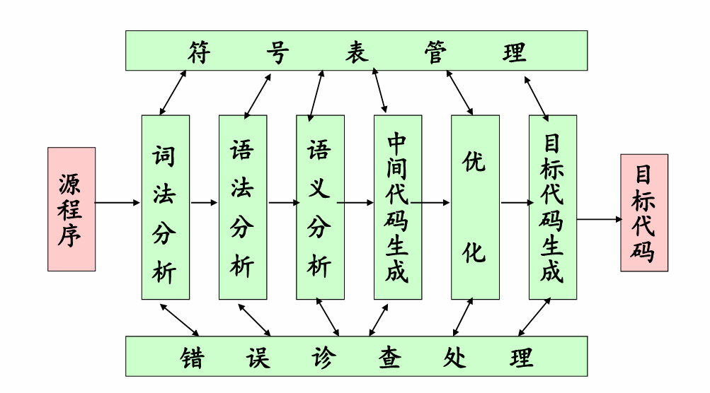

# L01: Introduction

## 1.编译的起源

### 1.1 程序设计语言的起源

- 低级语言（Low Level Language）：字位码、机器语言、汇编

与硬件相关，效率高，但不易读、易出错

- 高级语言（High Level Language）：Pascal、C/C++、Java等

不依赖具体机器，移植性好、对用户要求低、易
使用、易维护等

### 1.2 编译的基本概念

1. **源程序（Source Program）**：用汇编语言或高级语言编写的程序称为源程序。

2. **目标程序（Object Program）**：用目标语言所表示的程序。（**目标语言**：可以是介于源语言和机器语言之间的“中间语言”，可以是某种机器的机器语言,也可以是某机器的汇编语言。）

3. **翻译程序（Translator）**：将源程序转换为目标程序的程序称为翻译程序。

**编译（Compiling）**：就是把高级语言程序翻译成与其等价的目标语言程序的过程。

- 等价：相同的输入会有相同的输出
- 编译是在应用程序与硬件体系结构之间的接口
- 应当对所生成的程序进行一定的优化

### 1.3 编译器vs解释器

- 编译器Compiler：会直接把源程序转化为可执行程序；

- 解释器Inperpreter：在转换源程序的同时执行程序，而不会生成目标代码，相当于直接运行源程序（解释器也需要对源程序进行词法，语法和语义分析，中间代码生成）

经典编译流程先产生目标程序，再由目标程序处理输入；经典解释流程由解释器读入程序和数据并执行所描述的运算。两者都需要理解程序结构，解释器也可能进行词法分析、语法分析、语义检查，并建立 AST 或字节码。

课件指出二者可以混合：源代码先编译为中间代码，再由虚拟机执行；虚拟机也可以把经常执行的代码即时编译为机器代码，这称为 **JIT（just-in-time compilation）**。因此应讨论某个语言实现采用了什么机制，避免只按语言名称断言其必然“编译”或“解释”。

| 角度     | 典型提前编译          | 典型解释执行             |
| ------ | --------------- | ------------------ |
| 核心工作   | 先翻译出另一种程序表示     | 执行某种程序表示所描述的操作     |
| 运行方式   | 运行生成的目标程序       | 由解释执行引擎处理程序及输入     |
| 工作发生时间 | 较多分析和转换在运行前完成   | 一部分分析或调度工作发生在运行时   |
| 常见权衡   | 编译需时间，运行时开销通常较低 | 开发反馈方便，逐条解释通常有调度开销 |

## 2. 编译器的结构

现代编译器会通过**前端（frontend）**，将源代码翻译到中间代码（与机器无关）；而**后端（backend）**把中间代码翻译为具体的机器指令（目标代码）

**词法分析**的结果是代表单词的token流（Lex、Flex）

**语法分析**：为程序中赋值语句生成的分析树（YACC、Bison、ANTLR）

**语义分析**：为程序中赋值语句生成的抽象语法树

**中间代码表示**：为程序中赋值语句生成的中间代码表示

**代码优化 & 目标代码生成**

**符号表（symbol table）**记录名字及其声明信息，例如类别、类型、作用域、参数信息，以及后续确定的存储信息。本例至少涉及函数 cal、变量 a/b/c 和函数 printf。当语义分析遇到 c 时，通过名字查找获得其对应声明和 float 类型；后端再利用相关信息安排存储和访问。

**错误诊断与处理**：应尽可能给出文件、行、列及可操作的提示。

出错处理能力的大小是衡量编译程序质量好坏的一个重要指标。

研究/教学型编译器：SUIF、Soot、JikeRVM、LLVM

**阶段（phase）**按逻辑职责划分，例如语义分析、优化；**遍（pass）**描述一次对源程序或中间表示的遍历、分析或转换。课件用“从头到尾扫视一次”解释遍，其中文件是传统常见载体；现代实现也常直接遍历内存中的树或图。

## 3. 编译技术的应用

- 高级语言的实现（聚合数据类型、高级控制流、OOP、类型安全、并行编程……）

- 针对计算机体系结构的优化（并行化(多核、众核、云计算)、内存分层(memory hierarchy)）

- 新型计算机体系结构的设计

- 提高软件开发效率的工具（类型检查、边界检查、内存检查）

- 其他（软件测试、程序理解、程序变换……）

## 4. 程序设计语言基础

**静态(static)**通常指能够依据程序结构和语言规则，在运行前完成决定或分析；**动态（dynamic）**指决定依赖程序运行时的信息。同一个程序可以同时包含静态和动态机制，例如变量使用对应哪个声明可静态确定，而某次调用接收的数值由用户运行时输入。

某声明的**作用域（scope）**是程序中其名字使用能够关联到该声明的区域。**静态作用域（词法作用域）**依据源代码的嵌套结构解析名字；查找通常从当前位置的最内层作用域向外进行，同名内层声明会遮蔽外层声明。

环境（environment）：从名字到内存的映射；

状态（state）：从内存地址到值的映射

**传值调用（call by value）**先对实参求值，再将所得值放入形参自己的存储位置。形参与实参中的原变量拥有独立的存储位置，因此给形参重新赋值通常不会改写调用者的变量。

**引用调用（call by reference）**让形参访问实参所指的原存储位置；从实现直觉看，可以传递地址。因此通过形参赋值能够改变调用者的对象。某些语言有直接的引用参数语法；C 可以通过传入指针达到修改外部对象的效果，但其指针参数本身仍按值传递。

**名调用（call by name）**可以理解为每次使用形参时，在调用者环境下重新计算对应的实参表达式，通常借助携带环境的延迟计算结构实现。它不等于直接进行不顾名字绑定的文本替换，也不默认记忆第一次求值结果；自动记忆结果的按需调用（call by need）是相关但不同的机制。

**别名（Alias）**指不同访问路径可能指向同一存储位置，例如两个指针指向同一对象，或两个引用形参实际接收同一变量。